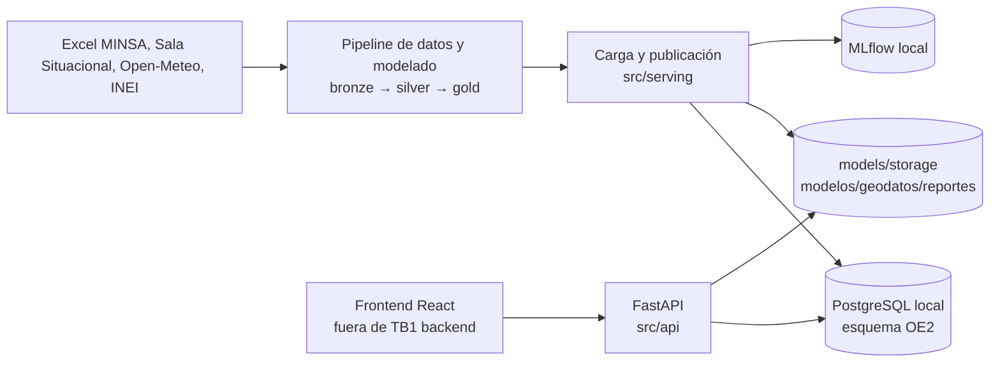
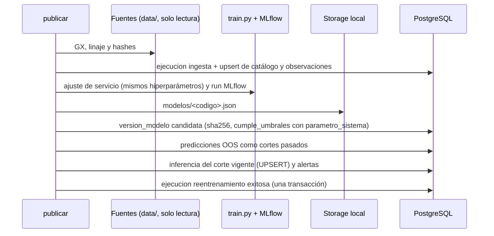
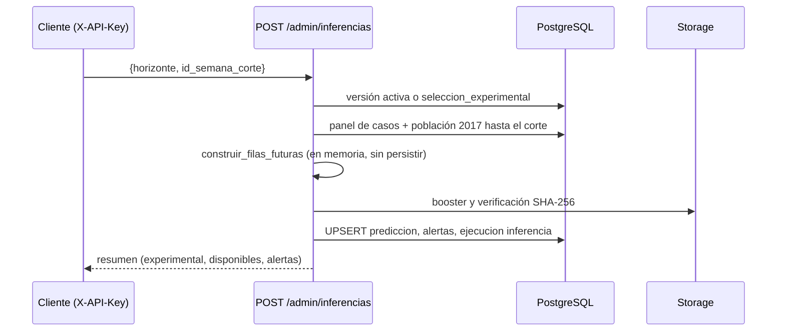

# Arquitectura del backend (esquema OE2)

Fuente de diseño: documento «OE2 Diseño de la Solución v1.1» (sección 5, Anexo B, Tabla 2),
resumido en [especificacion_oe2.md](especificacion_oe2.md). En TB1 todo es local.

## Contexto

## Contenedores y componentes

| Componente | Responsabilidad |
|---|---|
| `src/db` | Esquema SQLAlchemy portable (PostgreSQL / SQLite), migraciones Alembic (`0003_oe2`), sesiones y UPSERT |
| `src/serving/cargar_datos` | Ingesta validada (GX + linaje) de provincia, distrito, calendario y observaciones |
| `src/serving/modelos`, `publicar` | Ajuste de servicio con `src/modeling/train.py`, MLflow, versiones `candidata` y booster en Storage |
| `src/serving/almacenamiento` | Puerto `Almacenamiento` (`guardar`, `leer`, `existe`) y adaptador local; adaptador Supabase futuro |
| `src/serving/inferencia` | Vector desde la BD (`construir_filas_futuras`), selección activa/experimental, UPSERT, alertas, OOS |
| `src/serving/parametros` | Lectura de `parametro_sistema` (cortes, umbrales y bloque, selección experimental) |
| `src/api` | Routers de la Tabla 2, DTO por lotes, errores uniformes, caché por revisión, OpenAPI con ejemplos reales |

## Modelo de datos

Nueve tablas del DDL (`provincia`, `distrito`, `semana_epidemiologica`, `ejecucion`,
`observacion_semanal`, `version_modelo`, `prediccion`, `alerta`, `parametro_sistema`) más la
extensión `importancia_variable`. `ejecucion` audita todo (`ingesta`, `inferencia`,
`reentrenamiento`, `mantenimiento`). En PostgreSQL: ENUM nativos, `jsonb`, identity, CHECK con
regex, RLS y roles `rol_api` / `rol_pipeline`.

## Secuencia: publicación

## Secuencia: inferencia por la API

## Límites

- Corte de datos publicado: 27/12/2025; sin actualización automática ni scheduler.
- Ninguna versión cumple los umbrales: la demo sirve predicciones `experimental: true`.
- El mapa usa centroides; no hay polígonos en la referencia del proyecto.
