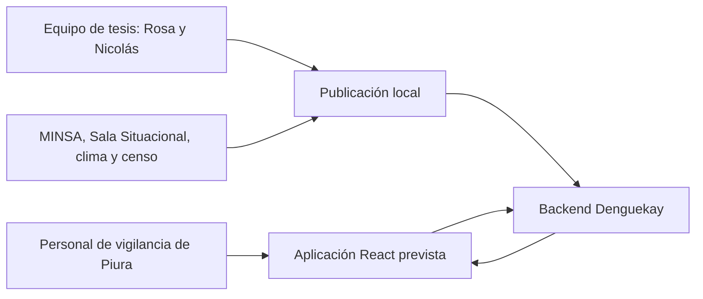
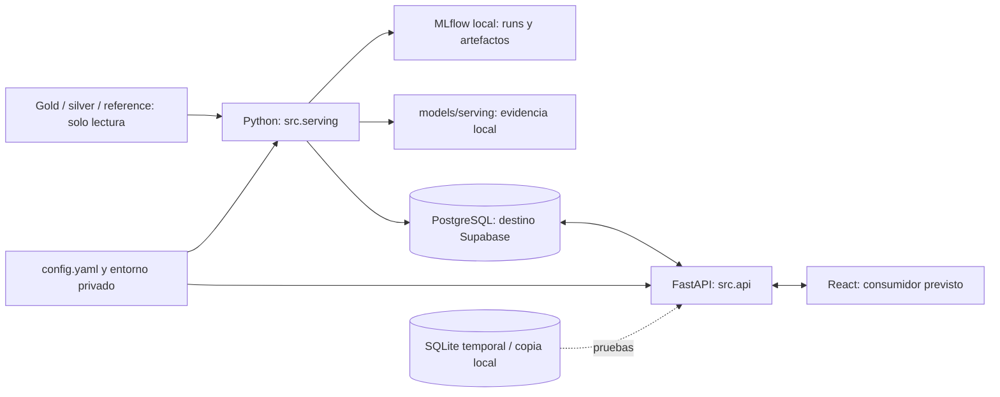
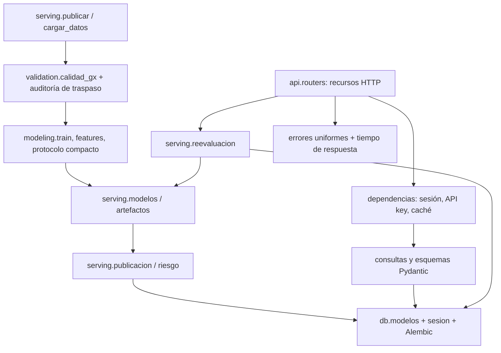
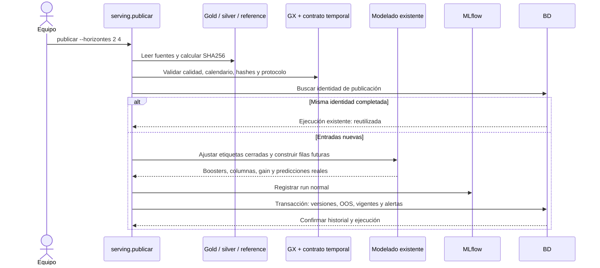

# Arquitectura del backend

El backend aplica publicación batch y consulta con reevaluación real. El pipeline
local lee fuentes agregadas, valida GX, reutiliza el modelado existente y publica
en una transacción SQL. La API usa únicamente la BD para obtener datos y cargar
el booster; no depende de los CSV, de `models/` ni del almacenamiento de MLflow.
React es un consumidor previsto y queda fuera de este encargo.

## C4: contexto



La unidad de información es distrito/semana epidemiológica. No se almacenan
personas. Estas fuentes son las entradas documentadas por el pipeline del repo;
el backend no accede directamente a servicios epidemiológicos externos.

## C4: contenedores



PostgreSQL local y SQLite se han ejecutado; Supabase y Render son destinos
previstos para la fase 5. MLflow registra experimentos y versiones de servicio
como runs; no se usa su Model Registry. La API no necesita `mlflow.db`.

## C4: componentes



El catálogo, observaciones y carga están separados de las versiones y ejecuciones.
Una predicción referencia clasificación, regresión y persistencia; conserva el
vector y el origen. Las alertas referencian predicciones y conservan sus retiros.
`activacion_modelo` audita cambios de selección. Los índices evitan duplicados de
observaciones y múltiples versiones activas por tipo/horizonte. Migraciones en
`src/db/migraciones/` son la autoridad del esquema; no se crea automáticamente al
arrancar la API.

## Secuencia: publicación



El OOS procede del CSV del protocolo de temporadas 2022–2024 y calendario 2025.
Sus versiones históricas sin booster no son reactivables. Si falta el CSV se
regenera con el módulo existente y salida separada en `models/serving/`; no se
fabrican predicciones ni se sobrescriben los resultados de Rosa.

## Secuencia: inferencia dentro de la API

```mermaid
sequenceDiagram
    actor Cliente
    participant API
    participant BD
    participant Modelo as XGBoost cargado desde BD
    Cliente->>API: POST recalcular + X-API-Key
    API->>API: Validar clave y horizonte
    API->>BD: Bloquear versiones; leer artefactos y vectores vigentes
    API->>API: Comprobar columnas, corte y política de validación
    API->>Modelo: Predecir con boosters guardados
    Modelo-->>API: Probabilidades y magnitudes
    API->>BD: Agregar ejecución/predicciones y actualizar alertas
    BD-->>API: Commit o rollback completo
    API->>API: Invalidar caché
    API-->>Cliente: Resultado con IDs y fecha de corte original
```

Activar una versión sigue la misma transacción y audita la selección si cambia.
Una falla de artefacto/esquema/corte devuelve 409 y conserva la selección anterior.
Los GET consultan revisión real de BD incluso en aciertos de caché; una conexión
fallida devuelve 503, sin servir el valor almacenado como vigente.

## Fechas y límites

La semana objetivo es `t`; la información utilizada cierra en `t−h`. El helper
compartido está en `src/utils/calendario.py`, usa MMWR y contempla la semana 53 de
2025. La corrección se documenta en
`docs/feature_engineering/correccion_calendario.md`.
`fecha_actualizacion` describe una escritura; `fecha_corte_datos` describe las
fuentes. Un recalculado no actualiza los datos epidemiológicos.

Para cifras verificadas, cobertura y latencias consultar
[fase4_calidad.md](fase4_calidad.md) y sus JSON de evidencia.
